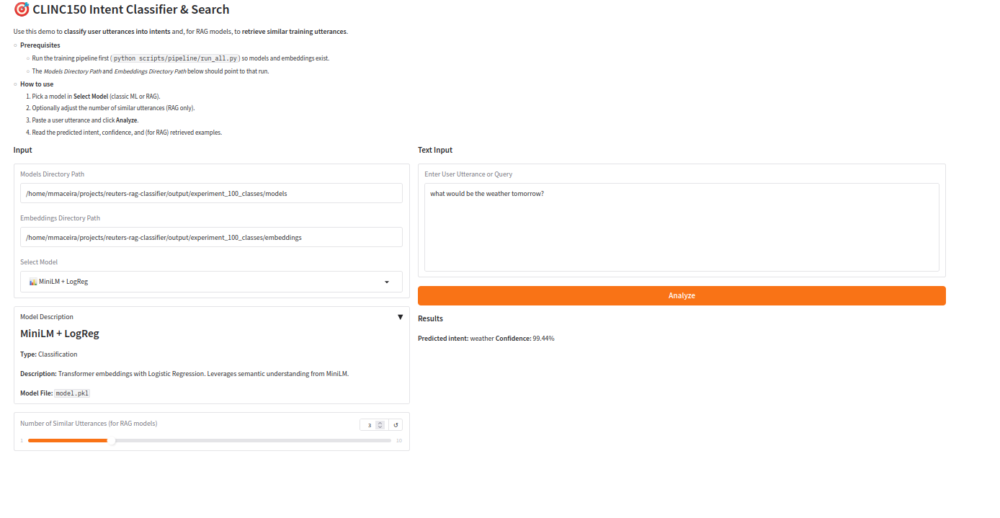
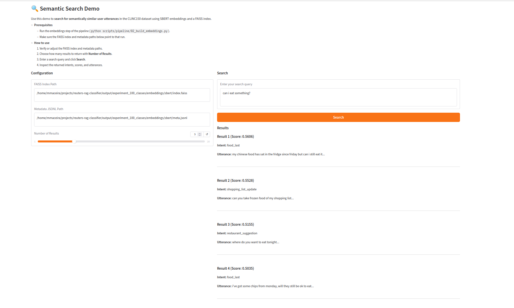
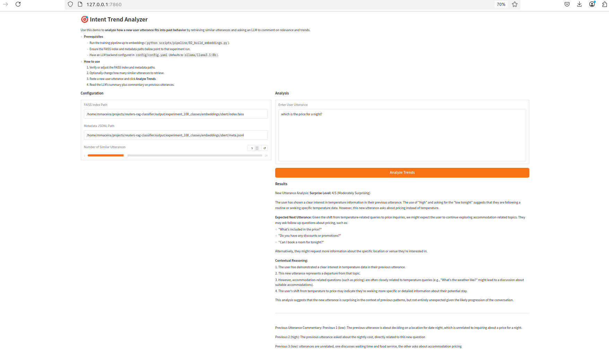

# CLINC150 Intent Classification & Semantic Search

A production-ready NLP pipeline for automated intent classification and semantic search, built on the CLINC150 dataset.

[](https://www.python.org/downloads/)
[](LICENSE)

## 🚀 Quick Start

**The CLINC150 dataset is automatically downloaded from HuggingFace** - no manual setup required!

```bash
# Install with uv (recommended)
uv sync --extra all

# Or install with plain pip
python -m venv .venv
source .venv/bin/activate
pip install -U pip
pip install -e ".[all]"

# Run a tiny end-to-end experiment (< 5 minutes)
# Single-label example (CLINC150)
CONFIG_FILE=config/dataset/clinc150/tiny.yaml python scripts/pipeline/run_all.py

# Multi-label example (NLU++)
CONFIG_FILE=config/dataset/nlu_plus/tiny.yaml python scripts/pipeline/run_all.py

# Multi-label example (Tandem GO - requires CSV file in data/ directory)
CONFIG_FILE=config/dataset/tandem_go/tiny.yaml python scripts/pipeline/run_all.py
```

That's it! The pipeline will automatically download the dataset, tune hyperparameters, train models, and generate predictions and evaluations. The system automatically detects whether you're using single-label or multi-label data and uses the appropriate evaluation metrics.

## 📚 Documentation

Comprehensive documentation is available in the [`docs/`](docs/) folder:

- **[Installation](docs/installation.md)** - Detailed installation instructions and dependencies
- **[Pipeline](docs/pipeline.md)** - Complete pipeline documentation: data, algorithms, and decision rationale for each step
- **[Algorithms](docs/algorithms.md)** - Algorithms used, implementation details, and why they were chosen
- **[Experiments](docs/experiments.md)** - Data types, splits, and selection strategies
- **[Running Experiments](docs/running_experiments.md)** - How to run experiments from quick start to advanced usage
- **[Configuration](docs/configuration.md)** - Configuration files and settings
- **[Hyperparameter Tuning](docs/hyperparameter_tuning.md)** - Hyperparameter optimization guide
- **[Model Architecture](docs/model_architecture.md)** - Detailed model architecture specifications
- **[LLM Providers](docs/llm_providers.md)** - Switching between Ollama, OpenAI, and other providers
- **[Development](docs/development.md)** - Development setup, code style, and contributing

## 📋 Overview

This project implements a comprehensive NLP pipeline for:
- Automated intent classification of user utterances (single-label and multi-label)
- Semantic search and document retrieval
- Business insights generation
- Real-time document similarity matching

Built on multiple datasets (CLINC150, NLU++, Tandem GO), it provides a production-ready solution for intent classification and information retrieval. The system supports both **single-label classification** (one intent per utterance) and **multi-label classification** (multiple intents per utterance), combining traditional machine learning approaches with modern transformer-based models and Retrieval-Augmented Generation (RAG) techniques.

### Use Cases

1. **Intent Classification**: Automatically classify user utterances into predefined intents
2. **Information Retrieval**: Find relevant examples based on semantic similarity
3. **Content Recommendation**: Suggest related intents based on content similarity
4. **Trend Analysis**: Track intent evolution and popularity over time
5. **Research & Analysis**: Support qualitative and quantitative research on intent data

## 🏗️ Project Structure

```
.
├── config/                    # Configuration files
├── docs/                      # Documentation
├── intent_classifier/         # Main source code
│   ├── algorithms/           # ML algorithms implementation
│   ├── datasets/             # Dataset handling
│   ├── evaluation/           # Model evaluation tools
│   ├── hparam/               # Hyperparameter tuning
│   ├── rag/                  # RAG implementation
│   └── utils/                # Utility functions
├── scripts/                   # Utility scripts
│   ├── api/                  # FastAPI implementation
│   ├── demos/                # Interactive Gradio demos
│   └── pipeline/             # Training pipeline scripts
├── tests/                     # Test files
├── pyproject.toml            # Package configuration
└── README.md                 # This file
```

## 🧠 Models

The pipeline includes multiple classification algorithms:

| Model | Architecture | Architecture Explanation | Use Case |
|-------|--------------|------------------------|---------|
| Multinomial Naive Bayes | TF-IDF + Naive Bayes | Text is converted to TF-IDF vectors (term frequency-inverse document frequency), then a probabilistic Naive Bayes classifier learns word probabilities per class assuming conditional independence | Fast, lightweight classification |
| Linear SVM | TF-IDF + SVM | Text is vectorized using TF-IDF (unigrams), then a Support Vector Machine with linear kernel learns optimal decision boundaries in the high-dimensional feature space | Balanced speed and accuracy |
| MiniLM + LogReg | Transformer + Logistic Regression | Text is encoded by a transformer model (MiniLM) into dense semantic embeddings, then a Logistic Regression classifier learns to separate classes in embedding space | High-accuracy classification |
| Embedding + LogReg | Flexible embeddings (SBERT/OpenAI) + Logistic Regression | Text is embedded using either local SBERT or OpenAI API embeddings into dense vectors, then Logistic Regression classifies in embedding space | High-accuracy with flexible embedding backend |
| RAG-CentroidNN | FAISS + Nearest Neighbors | Text is embedded, then FAISS retrieves k most similar training examples. The centroid (average) of their embeddings is computed, and classification is based on nearest neighbor to this centroid | Semantic search and classification |
| RAG-LLM | FAISS + LLM (Ollama/OpenAI) | Text is embedded, FAISS retrieves k most similar examples, then an LLM (Ollama or OpenAI) analyzes the query and retrieved context to make a context-aware classification decision | Context-aware classification |

See [Algorithms](docs/algorithms.md) and [Model Architecture](docs/model_architecture.md) for detailed information.

## 💡 Key Features

- **Multiple Algorithms**: From traditional ML to modern transformer-based and RAG models
- **Flexible Embeddings**: Support for SBERT (local) and OpenAI (API) embeddings
- **LLM Integration**: Support for Ollama (local) and OpenAI/Anthropic (API) via litellm
- **Hyperparameter Tuning**: Automated hyperparameter optimization with Ray Tune
- **Production-Ready**: Type-safe configuration, calibrated probabilities, comprehensive logging
- **Best Practices**: Proper train/validation/test splits, no data leakage

## 🚀 Usage

### Classify via CLI

The `intent-classify` command works with any trained model. You can specify:
- A direct model file path: `--model-path artifacts/model.pkl`
- A model directory: `--model-path output/experiment/models/Linear\ SVM/`

**Note**: The API server is **not required** for CLI classification. Models are loaded directly from disk.

```bash
# Using a model file path (single-label)
intent-classify --model-path artifacts/model.pkl --text "what's my account balance?"
# → {"label": "banking_balance", "confidence": 0.97}

# Using a model directory (models are stored here after training)
intent-classify --model-path output/experiment_tiny_dataset/models/Linear\ SVM/ --text "book me a flight to London"

# Multi-label models return a list of labels
intent-classify --model-path output/experiment_nlu_plus/models/Linear\ SVM/ --text "check my account balance and transfer money"
# → {"label": ["banking_balance", "banking_transfer"], "confidence": 0.95}
```

After training models:
```bash
# Train models (use CONFIG_FILE environment variable, not --config flag)
# Note: CONFIG_FILE should be the full path relative to repo root

# Single-label example
CONFIG_FILE=config/dataset/clinc150/tiny.yaml intent-train
intent-classify --model-path output/experiment_tiny_dataset/models/Linear\ SVM/ --text "book me a flight to London"

# Multi-label example (NLU++)
CONFIG_FILE=config/dataset/nlu_plus/tiny.yaml intent-train
intent-classify --model-path output/experiment_nlu_plus/models/Linear\ SVM/ --text "check my account balance and transfer money"

# Multi-label example (Tandem GO)
CONFIG_FILE=config/dataset/tandem_go/tiny.yaml intent-train
intent-classify --model-path output/tiny/models/Linear\ SVM/ --text "your text here"
```

### Serve API

The API server loads models from the experiment directory specified by `CONFIG_FILE` or `EXPERIMENT_NAME` environment variable. If neither is set, it defaults to `{repo_root}/models/`.

```bash
# Install API dependencies first
uv sync --extra api

# Use the same config file as training to load models from the correct directory
CONFIG_FILE=config/dataset/clinc150/tiny.yaml api-serve --host 0.0.0.0 --port 8000
# Or specify experiment name directly
EXPERIMENT_NAME=experiment_tiny_dataset api-serve --host 0.0.0.0 --port 8000

# Then open /docs and POST /v1/predict with {"model_id": "...", "text": "..."}
```

**Supported model IDs**: `naive_bayes`, `linear_svm`, `linear_svm_bigrams`, `transformer_logreg`, `embedding_logreg`, `rag_centroid`, `rag_kmajority`, `rag_llm_local`, `rag_llm_local_short`, `rag_llm_openai`

See `scripts/api/README_API.md` for endpoint details.

### Interactive Demos (Gradio UI)

After you have trained models and built embeddings (for example by running `python scripts/pipeline/run_all.py`),
you can explore the system with three interactive Gradio apps:

- **Intent Classifier & Search Demo** (`scripts/demos/intent_classifier_demo.py`)
  Classify a user utterance with any trained model (Naive Bayes, SVM, MiniLM + LogReg, RAG variants) and,
  for RAG models, retrieve similar training utterances.

  

- **Semantic Search Demo** (`scripts/demos/semantic_search_demo.py`)
  Run pure semantic search over CLINC150 using SBERT embeddings and a FAISS index.

  

- **Intent Trend Analyzer** (`scripts/demos/intent_trend_analyzer.py`)
  Retrieve similar past utterances and use an LLM to comment on **how surprising** the new utterance is
  and what future behavior you might expect.

  

### RAG-LLM (optional)

```bash
# OpenAI
export OPENAI_API_KEY=sk-...
rag-cli --provider openai --model gpt-4o-mini --labels data/labels.json --k 10 --text "reset my card pin"

# Ollama (local)
export OLLAMA_HOST=http://localhost:11434
rag-cli --provider ollama --model llama3.1:8b --labels data/labels.json --k 10 --text "reset my card pin"
```

Under the hood, the `rag-cli` entry point uses the shared `rag_llm` module, and the training pipeline integrates RAG-LLM via `intent_classifier.rag.rag_llm.classifier.RagLLM`. This keeps a single, consistent RAG-LLM implementation across CLI, library, and API usages.

### Complete Pipeline

```bash
# Run with default config
intent-train
# Or use the script directly:
python scripts/pipeline/run_all.py

# Run with custom config and tuning
# Note: CONFIG_FILE should be the full path relative to repo root
CONFIG_FILE=config/dataset/clinc150/tiny.yaml intent-train --tune --save-model artifacts/model.pkl
# Or use the script directly:
CONFIG_FILE=config/dataset/clinc150/tiny.yaml python scripts/pipeline/run_all.py --tune --save-model artifacts/model.pkl
```

### Individual Steps (Advanced)

```bash
python scripts/pipeline/00_data_loading.py          # Load and validate dataset
python scripts/pipeline/01_exploratory_analysis.py   # Analyze dataset characteristics
python scripts/pipeline/02_build_embeddings.py        # Generate embeddings
python scripts/pipeline/03_model_training.py          # Train models
python scripts/pipeline/04_model_prediction.py        # Generate predictions
python scripts/pipeline/05_model_evaluation.py       # Evaluate model performance
```

See [Running Experiments](docs/running_experiments.md) for more details.

## ⚙️ Configuration

The project uses YAML configuration files organized by label type and dataset:

- **Main config** (`config/{singlelabel|multilabel}/{dataset_name}/{config_name}.yaml`): Controls dataset, paths, embedding backends, and LLM models
- **Models config** (`config/models_config.yaml`): Controls which models are trained and their hyperparameters

The system automatically detects whether you're using single-label or multi-label data based on the config file path and dataset format. All models support both single-label and multi-label classification.

See [Configuration](docs/configuration.md) for details.

**Quick example:**
```bash
# Single-label config (CLINC150)
CONFIG_FILE=config/dataset/clinc150/tiny.yaml intent-train

# Multi-label config (NLU++)
CONFIG_FILE=config/dataset/nlu_plus/tiny.yaml intent-train

# Multi-label config (Tandem GO)
CONFIG_FILE=config/dataset/tandem_go/tiny.yaml intent-train

# Or use the script directly:
CONFIG_FILE=config/dataset/clinc150/tiny.yaml python scripts/pipeline/run_all.py
```

**To enable/disable models**: Edit `config/models_config.yaml` and set `enabled: true/false` for each model.

## 🎯 Hyperparameter Tuning

Hyperparameter tuning is integrated into the pipeline:

```bash
# Run pipeline with tuning
intent-train --tune
# Or use the script directly:
python scripts/pipeline/run_all.py --tune

# Or tune separately
# Note: CONFIG_FILE should be the full path relative to repo root
CONFIG_FILE=config/dataset/clinc150/tiny.yaml python scripts/tune_hyperparams.py --all
```

Tuned hyperparameters are automatically used during training. See [Hyperparameter Tuning](docs/hyperparameter_tuning.md) for details.

## 📊 Performance

Performance metrics, resource requirements, and scaling guidance are provided below. Most of the pipeline runs comfortably on CPU; GPU is only required for the heaviest transformer-based models.

### CLINC150 (100-class subset) benchmark - Single-Label

On a 100-class CLINC150 configuration, the current pipeline achieves the following test metrics:

| Model                         | Accuracy | Macro F1 | Weighted F1 |
|------------------------------|----------|----------|-------------|
| Naive Bayes                  | 0.8450   | 0.8431   | 0.8431      |
| Linear SVM                   | 0.8567   | 0.8552   | 0.8552      |
| TF-IDF bigrams + SVM         | 0.8540   | 0.8537   | 0.8537      |
| MiniLM + LogReg              | 0.9660   | 0.9658   | 0.9658      |
| RAG-CentroidNN               | 0.9330   | 0.9309   | 0.9309      |
| RAG-kMajority                | 0.9277   | 0.9263   | 0.9263      |
| RAG-LLM (local embeddings)   | 0.9370   | 0.7330   | 0.9456      |
| RAG-LLM (OpenAI embeddings)  | 0.9380   | 0.7225   | 0.9465      |

Published CLINC150 baselines on the full 150-intent dataset typically report transformer models in the **94–97% accuracy** range, with simpler TF‑IDF/SVM or CNN models around **90–95%**; your MiniLM + LogReg and RAG variants are therefore competitive with strong literature baselines while also providing richer RAG-style behaviors (e.g., explanations, retrieval) on top of high classification performance.

### Multi-Label Classification

For multi-label tasks, the system uses appropriate metrics:
- **Subset Accuracy**: Exact match ratio (all labels must match)
- **Hamming Loss**: Average fraction of labels incorrectly predicted
- **Jaccard Similarity**: Intersection over union of predicted and true labels
- **Precision/Recall/F1**: Computed per-label (macro/micro averages)

All models support multi-label classification automatically when trained on multi-label datasets (NLU++).

**Quick reference:**
- **Naive Bayes**: Fastest inference (60k docs/s), minimal resources
- **Linear SVM**: Balanced speed and accuracy (12-15k docs/s)
- **Transformer Models**: Highest accuracy (~1k docs/s, requires GPU)
- **RAG Models**: Context-aware classification (150-200 QPS)

## 🛠️ Development

See [Development](docs/development.md) for development setup, code style, and contributing guidelines.

**Quick setup:**
```bash
# Install dev dependencies
uv sync --extra dev
pre-commit install

# Run tests
uv run pytest -q

# Run integration tests
uv run pytest -m integration -q

# Format code
uv run black intent_classifier/ scripts/
uv run ruff check intent_classifier/ scripts/
```

## 🔧 Troubleshooting

### Missing API Key
- **OpenAI**: Set `OPENAI_API_KEY` environment variable
- **Ollama**: Ensure `OLLAMA_HOST` is set (default: `http://localhost:11434`)

### FAISS Issues
- If you see FAISS import errors, ensure `faiss-cpu` is installed in your environment
- For GPU support, install `faiss-gpu` instead

### Long First Run
- The first run downloads the dataset (CLINC150 ~50MB, NLU++ ~10MB) from HuggingFace/GitHub
- This is a one-time download and is cached for subsequent runs
- Use `config/dataset/clinc150/tiny.yaml` or `config/dataset/nlu_plus/tiny.yaml` for faster testing

### Model Not Found
- Ensure you've run the training pipeline first: `python scripts/pipeline/run_all.py`
- Check that models are saved in `output/{run_name}/models/`

## 🙏 Acknowledgments

- CLINC150 dataset (HuggingFace, see [CLINC150 dataset card](https://huggingface.co/datasets/clinc/oos) for license and usage details)
- Hugging Face Transformers
- FAISS for similarity search
- OpenAI for embedding models
- litellm for multi-provider LLM support

## 📖 Additional Resources

- [Installation Guide](docs/installation.md)
- [Algorithms Documentation](docs/algorithms.md)
- [Experiments Guide](docs/experiments.md)
- [Running Experiments](docs/running_experiments.md)
- [Configuration Guide](docs/configuration.md)
- [Hyperparameter Tuning](docs/hyperparameter_tuning.md)
- [Model Architecture](docs/model_architecture.md)
- [LLM Providers](docs/llm_providers.md)
- [Development Guide](docs/development.md)
